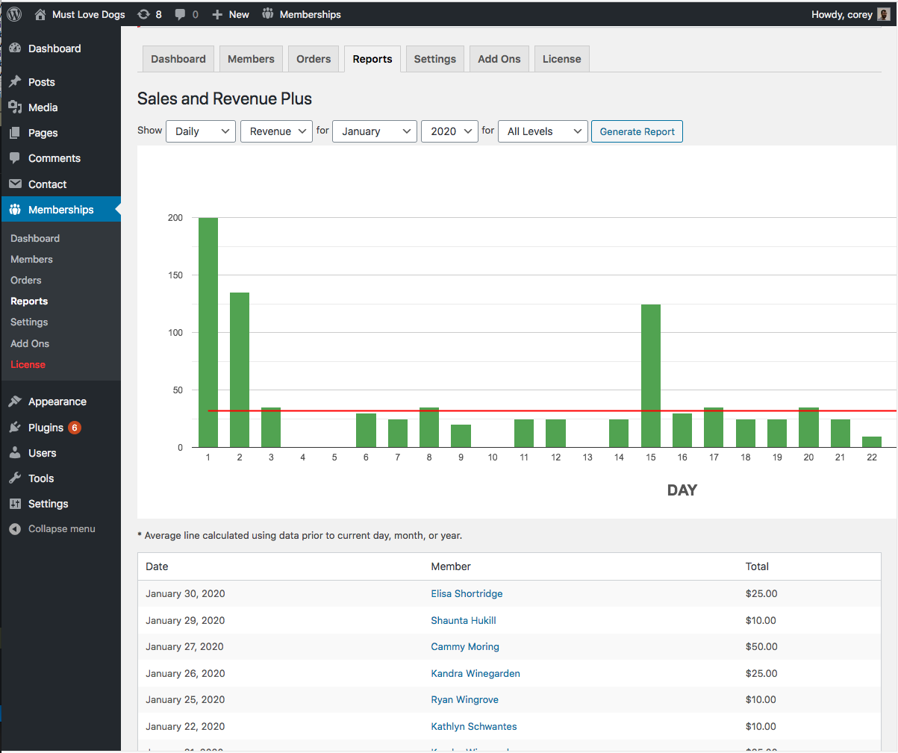

# pmpro-sales-report-plus
WordPress plugin. Add-on for Paid Memberships Pro. Adds a table full of customer names and dollar amounts to a copy of the Sales &amp; Revenue report.

## Screenshot

This screenshot shows the report running on the Must Love Dogs demo database.

## Instructions

This plugin adds a copy of the Sales &amp; Revenue report to the Memberships → Reports dashboard called Sales &amp; Revenue Plus. Click the report widget to view the Sales &amp; Revenue chart plus a table containing customer names, dates, and dollar amounts. 